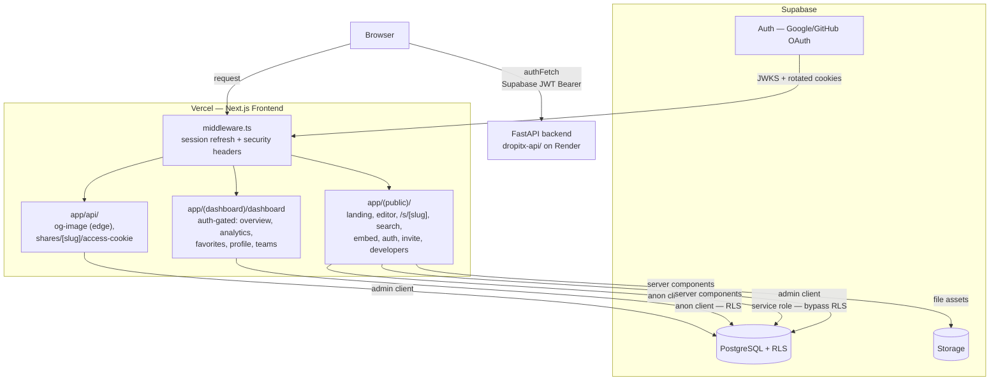

<!-- generated-by: gsd-doc-writer -->

# Architecture

> Canonical architecture reference for the **DropItX frontend** — the Next.js (App Router) client. Grounded in source; all paths cite real files.

## System Overview

DropItX is a file/text sharing product with team collaboration. This repository is the **pure frontend**: a Next.js 16 (App Router, React 19, TypeScript strict) application that deploys to Vercel and owns no business logic of its own. It is one of three sibling repos:

- `dropitx/` (this repo) — Next.js frontend on Vercel.
- `dropitx-api/` — FastAPI backend (document CRUD, API keys) on Render, called via REST.
- `dropitx-cli/` — Python/Click CLI published to PyPI as `dropitx`; a separate client, not bundled here.

The frontend is a **thin client with two data backends**. It renders UI and manages OAuth sessions, then talks to:

1. **Supabase** (PostgreSQL, Storage, Auth) — directly, for session management, RLS-protected reads in server components, and team RPC (`SECURITY DEFINER` functions).
2. **FastAPI backend** — via the browser, for document/key operations, using the Supabase JWT as a Bearer token.

The architectural style is **App Router with route groups**: server components by default, `"use client"` only for editor/interactive UI, and an Edge-capable middleware that refreshes sessions and injects security headers on every request.

## Component Diagram



The (public) and (dashboard) route groups are Next.js route groups (parenthesized names) — they organize routes and select layouts without adding URL segments. `app/api/` holds the only two remaining server endpoints; all other business logic has moved to the FastAPI backend.

## Data Flow

### 1. Every request — session refresh and headers

`middleware.ts` runs on all routes except static assets and `api/og-image`. It calls `updateSession()` (`utils/supabase/middleware.ts`), which:

1. Creates a Supabase SSR server client sharing cookies across the apex domain (cookie domain `.dropitx.site`).
2. Calls `supabase.auth.getClaims()`, which **validates the JWT locally via JWKS** and refreshes the access token if expired or near expiry.
3. Writes any rotated auth cookies back onto both the request (so downstream server code sees fresh tokens) and the response (so the browser persists them).

The returned response is then decorated with security headers (`x-content-type-options`, `x-frame-options: DENY`, `x-xss-protection`, `referrer-policy`, `permissions-policy`) and HSTS in production. **Callers must return this response** — dropping it loses the rotated cookies and causes refresh-token reuse / random logouts.

### 2. Route dispatch and auth gating

- **`(public)/`** — unauthenticated surface. Renders the landing page (`app/(public)/page.tsx` → `components/home-page.tsx`), the CodeMirror editor (`app/(public)/editor/`), the share viewer (`app/(public)/s/[slug]/`), search, embed (`app/(public)/embed/[slug]/`), the developers page, the OAuth flows (`auth/login`, `auth/callback`, `auth/confirm`, `auth/reset-password`, `auth/update-password`), and invite acceptance (`invite/accept`).
- **`(dashboard)/dashboard/`** — auth-gated surface. Its layout (`app/(dashboard)/dashboard/layout.tsx`) calls `supabase.auth.getUser()` and `redirect("/auth/login")` when there is no user, then loads the user's teams for the sidebar. Sub-routes: overview, `analytics/[slug]`, `favorites`, `profile`, `teams/new`, `teams/[slug]` (+ `members`, `settings`).

### 3. Viewing a share — `/s/[slug]`

`app/(public)/s/[slug]/page.tsx` is a server component that:

1. Reads share metadata with `createAdminClient()` (service role, bypasses RLS) so it can render even before any access check.
2. Generates OpenGraph metadata; **private or password-protected shares get generic "Protected Document" OG tags** (no content leak) — the same rule is enforced by the edge OG-image route (`app/api/og-image/[slug]/route.tsx`, `runtime = "edge"`).
3. Gates password-protected shares behind `PasswordGate` (client component). On unlock, it `POST`s to `/api/shares/[slug]/access-cookie`, which calls `setAccessCookie()` (`lib/share-access-cookie.ts`) to drop an **HMAC-signed access cookie** (`SHARE_ACCESS_SECRET`). On subsequent loads the server re-admits the viewer via `hasValidAccessCookie()`.
4. Renders HTML content through `components/html-viewer.tsx` inside a sandboxed iframe (`sandbox="allow-scripts"`); embeds (`app/(public)/embed/[slug]/`) use the same sandboxing.
5. Records the view server-side via `lib/analytics-track.ts` (SHA-256 hashing + signed tracking token) and client-side via the `ShareViewedTracker` component; `lib/analytics.ts` forwards named events to Vercel Analytics.

### 4. Writing to the backend — `authFetch`

Client components that mutate documents call `authFetch()` (`lib/api-client.ts`):

1. Pulls the Supabase session from the browser client (`utils/supabase/client.ts`) and sets `Authorization: Bearer <access_token>` against `${NEXT_PUBLIC_API_URL}` (default `http://localhost:8000`).
2. Sends the request with `Content-Type: application/json` unless the body is `FormData`.
3. **On `401`, refreshes the session once and retries** — a single retry to recover from expired tokens without bouncing the user to login.

Server components and route handlers do **not** use `authFetch`; they read/write Supabase directly via the anon client (RLS-enforced) or the admin client (service role), plus `SECURITY DEFINER` RPC for team operations (`lib/team-rpc.ts`).

## Key Abstractions

| Abstraction | File | Responsibility |
| --- | --- | --- |
| `authFetch`, `getAuthHeaders`, `getApiUrl` | `lib/api-client.ts` | Browser→FastAPI calls; injects Supabase JWT Bearer, single 401 refresh-retry. |
| `createClient` (server, anon) | `utils/supabase/server.ts` | RLS-respecting server client for user-facing reads. |
| `createAdminClient` (server, service role) | `utils/supabase/server.ts` | Bypasses RLS for server-side writes and metadata lookups (OG, share view). Throws if `SUPABASE_SERVICE_ROLE_KEY` is unset. |
| `createClient` (browser) | `utils/supabase/client.ts` | Browser client; session stored in chunked cookies shared across tabs and readable by middleware/server. |
| `updateSession` | `utils/supabase/middleware.ts` | Middleware-only JWT refresh + cookie rotation; called from `middleware.ts`. |
| `encrypt`/`decrypt`, `generateRandomKey`, `deriveKeyFromPassword` | `lib/crypto.ts` | AES-256-GCM E2E encryption via Web Crypto; key carried in the URL fragment (`#key=…`), never sent to the server. PBKDF2 with 600k iterations for password-derived keys. |
| `hashPassword`/`verifyPassword` | `lib/password.ts` | bcryptjs hashing for password-protected shares. |
| `setAccessCookie`/`hasValidAccessCookie` | `lib/share-access-cookie.ts` | HMAC-signed cookies that re-admit viewers who already unlocked a protected share. |
| `generateApiKey`/`hashApiKey` | `lib/api-key.ts` | API key generation and SHA-256 hashing (keys are never persisted in plaintext). |
| `createEditorExtensions`, `themeCompartment`, `updateTheme` | `lib/editor-extensions.ts` | CodeMirror 6 extension bundle (slash commands, image drop, theme switching). |
| Slash commands, image drop/preview | `lib/editor-extensions/slash-commands.ts`, `image-drop.ts`, `image-preview.ts` | CodeMirror plugins for `/image`, `/heading`, `/code` and inline drag-and-drop uploads. |
| `getHighlighter` | `lib/shiki-highlighter.ts` | Shiki singleton for GitHub-like code-block rendering. |
| `trackEvent`, `AnalyticsEvent` | `lib/analytics.ts` | Client-side Vercel Analytics events with 5s throttle. |
| `sha256`, `generateTrackingToken`, `verifyTrackingToken` | `lib/analytics-track.ts` | Server-side view tracking with hashed IPs and signed tokens. |
| Team RPC wrappers | `lib/team-rpc.ts` | `SECURITY DEFINER` Postgres functions for team/invite/member/ownership operations (uses admin client). |
| `fetchWithRateLimit`, `RateLimitError` | `lib/rate-limit.ts` | Client-side rate-limit handling with toast surfaced via `showRateLimitToast`. |
| Draft storage | `lib/draft-storage.ts` | localStorage auto-save for the editor (`saveDraft`/`loadDraft`/`hasDraft`). |

Shared domain types live in `types/` (`share.ts`, `team.ts`, `team-event.ts`, `analytics.ts`). Additional client hooks live in `hooks/` (`use-email-validation.ts`, `use-team.ts`, `use-toast.ts`) alongside the editor/auth hooks colocated in `lib/` (`use-auth-user.ts`, `use-auto-save.ts`, `use-editor-auto-save.ts`, `use-scroll-sync.ts`).

## Directory Structure Rationale

```
app/                         Next.js App Router — routes only, minimal logic
  (public)/                  Unauthenticated surface + its own layout
    page.tsx                 Landing (renders components/home-page.tsx)
    editor/page.tsx          CodeMirror editor (SSR disabled)
    s/[slug]/page.tsx        Public share viewer (sandboxed iframe)
    search/                  Full-text search
    embed/[slug]/            Embeddable share view (sandboxed iframe)
    developers/              Developer/API docs page
    auth/                    login, callback, confirm, reset/update-password
    invite/accept/           Team-invite acceptance
  (dashboard)/dashboard/     Auth-gated surface; layout redirects anon → /auth/login
    page.tsx                 Overview (user's shares + upload)
    analytics/[slug]/        Per-share analytics
    favorites/, profile/     Self-service account areas
    teams/                   new, [slug]/members, [slug]/settings
  api/                       Only two endpoints remain (rest is in FastAPI)
    og-image/[slug]/         Edge runtime OG-image generation
    shares/[slug]/access-cookie   Sets HMAC access cookie after password unlock
  layout.tsx                 Root layout: fonts, ThemeProvider, ErrorBoundary, Toaster, VercelAnalytics
  globals.css                Tailwind 4 + OKLCH design tokens
components/                  Feature components (kebab-case, <200 lines each)
  ui/                        shadcn/ui primitives (button, dialog, select, card, …)
  auth/, analytics/          Sub-grouped feature components
lib/                         Utilities + colocated client hooks
  editor-extensions/         CodeMirror plugins (slash-commands, image-drop, image-preview)
hooks/                       Additional client hooks
utils/supabase/              Supabase client factories: client, server (+admin), middleware, profile
types/                       Shared TypeScript interfaces
supabase/                    schema.sql + timestamped migrations (RLS on all tables)
public/                      Static assets (OG defaults, icons, etc.)
middleware.ts                Session refresh (updateSession) + security headers
```

**Why this shape:**

- **Route groups (`(public)` / `(dashboard)`)** let each surface pick its own layout and auth posture without polluting the URL. `(dashboard)` centralizes the `getUser()` + redirect gate in its layout so no sub-route can accidentally render for an anonymous user.
- **Two Supabase clients** (`createClient` anon / `createAdminClient` service role) make the RLS boundary explicit at the call site — user-facing reads stay RLS-enforced, while server-only operations (OG metadata, share viewing, team RPC) opt into the bypass deliberately.
- **`app/api/` is intentionally tiny** (OG images + access cookies) because business logic migrated to the FastAPI backend; the frontend's API routes only do what must run on the same origin.
- **`components/ui/` (shadcn/ui) vs `components/*`** separates owned primitives from product-specific components; the latter are kept under 200 lines and prefer composition over nesting.
- **`lib/` holds both utilities and some hooks**, colocating editor/auth hooks with the code they drive; `hooks/` holds the remaining general-purpose client hooks.

## Notes

- **No test framework is configured.** Correctness is verified via `npm run lint` and `npm run build` (TypeScript strict, no `any` — use `unknown` and narrow).
- **Editor SSR is disabled.** CodeMirror depends on browser APIs and is loaded via dynamic import with `ssr: false`.
- **Cookie domain is pinned to `.dropitx.site`** so the session survives apex ↔ `www` redirects on Vercel. <!-- VERIFY: production apex domain served by Vercel -->
- **No `next.config.ts` customization** — the config object is empty; all runtime behavior comes from environment variables and middleware.
